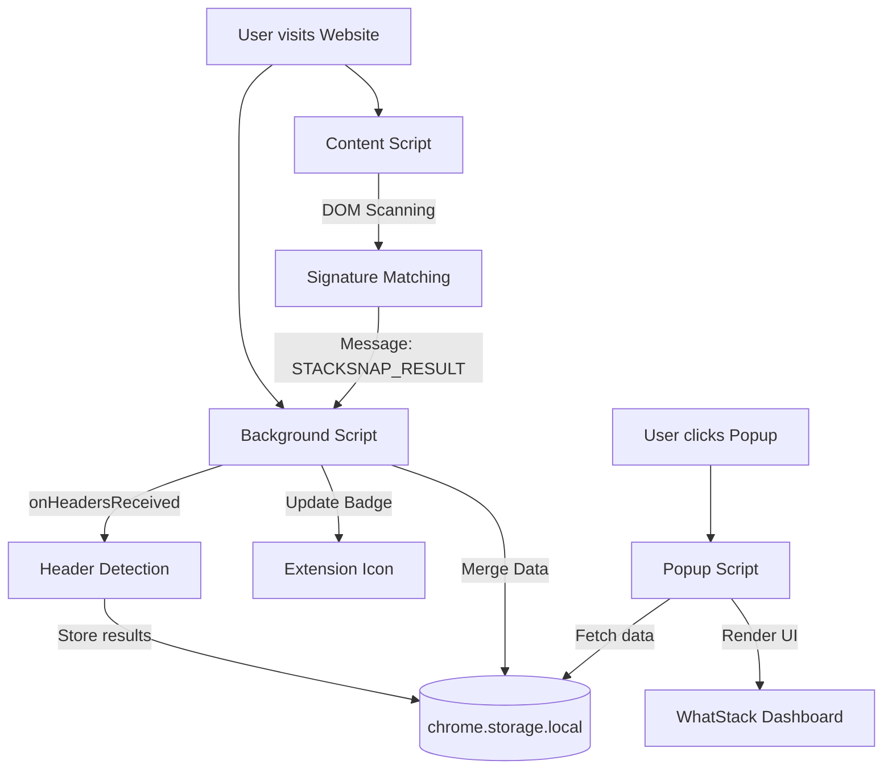

# WhatStack — Professional Website Technology Profiler


**WhatStack** is a high-performance Chrome Extension designed for deep **Stack Scan** analysis. Instantly detect the underlying technologies of any website — from frameworks and CMS to analytics and hosting providers.

## 🚀 Key Features

- **Instant Technology Detection**: Identify React, Vue, Next.js, WordPress, Shopify, and 100+ other technologies in milliseconds.
- **Deep Signal Analysis**: Goes beyond simple fingerprinting by scanning HTTP response headers, global variables, and meta tags.
- **Clean Categorized UI**: Technologies are grouped by category (Frameworks, E-commerce, Analytics, etc.) for easy reading.
- **Privacy First**: All detection logic runs locally on your device with zero data collection or tracking.
- **Developer-Focused**: Built with Manifest V3 for maximum performance and zero impact on browser speed.

## 🧠 How it Works

WhatStack uses a dual-engine approach to ensure maximum detection accuracy:

1.  **Passive Header Analysis**: The background service worker listens to HTTP response headers (e.g., `X-Powered-By`, `Server`) to identify server-side infrastructure.
2.  **Active DOM Scanning**: The content script analyzes global JavaScript variables, script source patterns, and meta tags to identify client-side libraries and frameworks.

### 🏗️ Architecture Diagram



## 🛤️ User Flow

1.  **Install**: Load the extension into Chrome/Brave/Edge.
2.  **Browse**: Visit any website you're curious about.
3.  **Observe**: Look at the extension icon; it will show a badge count of detected technologies.
4.  **Analyze**: Click the icon to open the **WhatStack Dashboard** for a detailed breakdown.
5.  **Research**: Click on technology links to learn more about the stack.

## 🛠️ Tech Stack

- **Extension**: Manifest V3, Vanilla JS, HTML5, CSS3.
- **Landing Page**: Modern HTML/CSS with GEO/AEO/SEO optimizations.
- **Deployment**: Vercel ready.

## 📂 Project Structure

```text
whatstack/
├── manifest.json       # Extension configuration
├── popup/              # Extension UI
├── content/            # Detection engine
├── background/         # Service worker
├── data/               # Technology signatures
├── icons/              # Brand assets
└── index.html          # Professional landing page
```

## 📦 Installation (Developer Mode)

1. Clone this repository:
   ```bash
   git clone https://github.com/drdhavaltrivedi/whatstack.git
   ```
2. Open Chrome and navigate to `chrome://extensions/`.
3. Enable **Developer mode** (top right toggle).
4. Click **Load unpacked** and select the `whatstack` directory.

## 🌐 SEO, GEO & AEO Optimization

This project is meticulously optimized for:
- **SEO (Search Engine Optimization)**: High-intent keywords like "Stack Scan", "Tech Stack Detector", and "Website Analyzer".
- **GEO (Generative Engine Optimization)**: Structured data (JSON-LD) for AI search engines like Perplexity and SearchGPT.
- **AEO (Answer Engine Optimization)**: Question-Answer semantic structures for direct LLM discovery.

## 🗺️ Project Roadmap

- [ ] **Pro Tier**: Historical scan tracking and export to CSV/JSON.
- [ ] **Enhanced Signatures**: Support for 500+ technologies including niche headless CMS.
- [ ] **Site Comparisons**: Benchmarking your tech stack against competitors.
- [ ] **Browser Sync**: Sync your scan history across devices.

## 👨‍💻 Developer
Developed with ❤️ by [Dr. Dhaval Trivedi](https://drdhaval.in)

🔗 **GitHub Profile:** [drdhavaltrivedi](https://github.com/drdhavaltrivedi)

## 📄 License & Privacy

- **Privacy Policy**: [Read here](https://whatstack.brilworks.com/privacy)
- **License**: MIT

---

Built with ❤️ by [Brilworks](https://brilworks.com)
